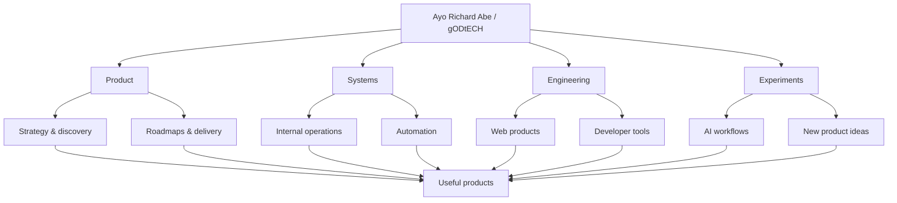
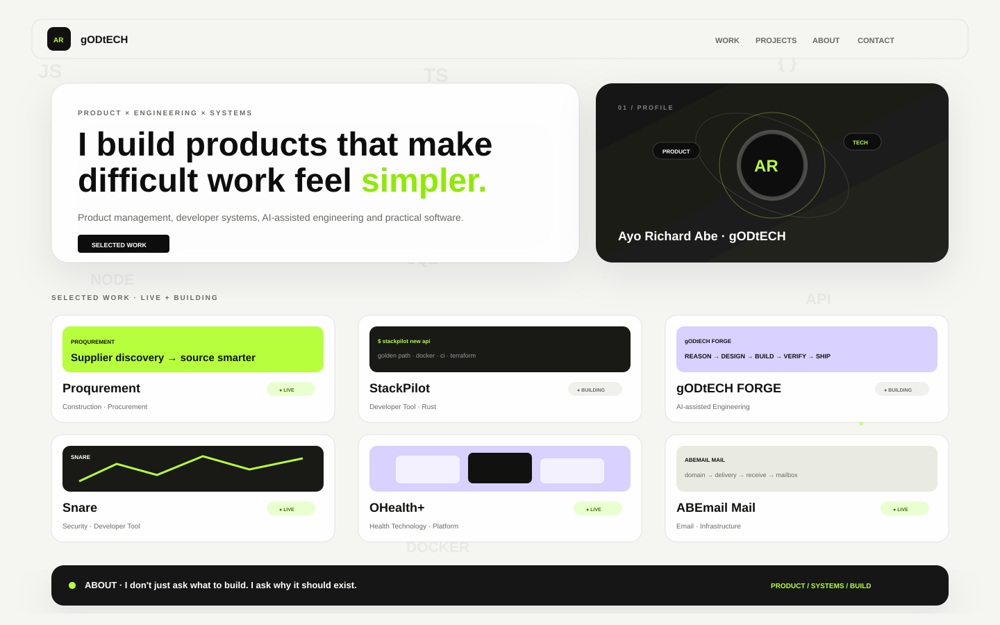
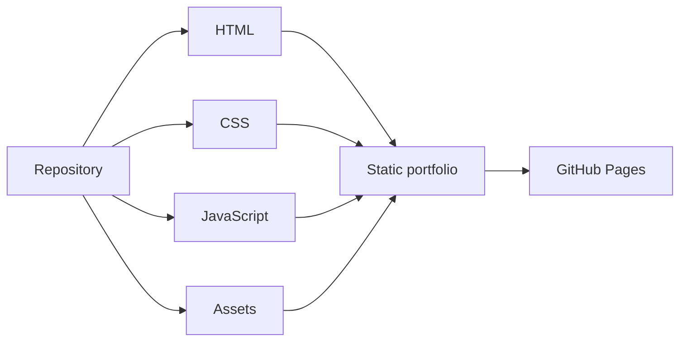

<a name="readme-top"></a>

<div align="center">



<p>
  
  
  
  
</p>

### Product manager · Product builder · Systems thinker


<p>
  <a href="https://godtech-ctl-create.github.io/Ayo-Richard-ABE/">Live portfolio</a> ·
  <a href="#-selected-work">Selected work</a> ·
  <a href="#-for-developers">For developers</a> ·
  <a href="#-how-i-work">How I work</a> ·
  <a href="#-core-toolkit">Toolkit</a>
</p>

</div>

---

## ⚡ The 30-second version

This repository is the personal portfolio of **Ayo Richard Abe / gODtECH** — a product manager and product builder working where **product thinking, engineering, automation, and systems design** meet.

I like problems that begin messy: unclear workflows, disconnected tools, repetitive work, or ideas that need to become something people can actually use.

```text
REAL PROBLEM
     ↓
PRODUCT THINKING
     ↓
PROTOTYPE + VALIDATION
     ↓
WORKING SYSTEM
     ↓
SHIP → LEARN → IMPROVE
```

The portfolio brings together live products, active builds, internal systems, developer tools, infrastructure experiments, and the thinking behind them.

<a href="#readme-top">↑ back to top</a>

---

## 🚀 Selected work

A few projects that best represent the range of problems I work on:

| Project | State | Area | What it explores |
| --- | --- | --- | --- |
| **[Proqurement](https://proqurement.onrender.com/)** | 🟢 Live | Construction · Procurement | Supplier discovery, comparison, sourcing, and market intelligence |
| **[StackPilot](https://github.com/gODtECH-Ctl-Create/StackPilot)** | 🟡 Building | Developer Tool · Rust | Opinionated project scaffolding and production-minded golden paths |
| **[gODtECH FORGE](https://github.com/gODtECH-Ctl-Create/gODtECH-FORGE)** | 🟡 Building | AI · Engineering | Orchestrated reasoning, governance, engineering, verification, and AI-assisted development |
| **[Snare](https://avioflagos.github.io/snare/)** | 🟢 Live | Security · Developer Tool | Software supply-chain scanning for malicious repository payloads |
| **[OHealth+](https://github.com/gODtECH-Ctl-Create/Ohealth-be)** | 🟢 Live | Health Technology | Patient access, bookings, professional workflows, APIs, and dashboards |
| **[ABEmail Mail](https://github.com/gODtECH-Ctl-Create/ABEmail-Mail)** | 🟢 Live | Email · Infrastructure | Organization-owned business email, delivery, receiving, and operations |
| **[SAYRR](https://github.com/gODtECH-Ctl-Create/SAYRR)** | 🟡 Building | Voice · Product | Voice-first text input and low-friction desktop interaction |
| **[MortgageOps](https://github.com/gODtECH-Ctl-Create/MortgageOps)** | 🟡 Building | Finance · Operations | Mortgage case management, underwriting, servicing, risk, and operational control |
| **TechTrack** | 🟡 Building | Education · Career | Learning, bootcamps, internships, cohorts, progress, and certificates |

The wider catalogue also includes **Cyfamod SMS, Vettika, NanoClick, Lead Engine, Waste2Light, ABE TechLab Operations, ABE TechLab, Waste2Work, Cloud Infrastructure Platform, and Lucid**.

---

## 🧑‍💻 For developers

A growing part of the portfolio is focused specifically on reducing friction for developers and technical teams.

```text
STACKPILOT  →  scaffold production-minded repositories
FORGE       →  structure AI-assisted product + engineering work
SNARE       →  inspect software-supply-chain risk
CLOUD LAB   →  explore infrastructure foundations
ABEMAIL     →  build around managed email infrastructure
OPS         →  organize technical and AI-assisted operations
```

The website now has a dedicated **For Developers** section so these tools are easier to find without mixing them into every product category.

---

## 🧭 How the work connects



The point is not technology for its own sake. The goal is to connect **what should be built**, **how it should work**, and **how to make it easier to operate**.

---

## 🧠 How I work

<table>
<tr>
<td width="50%" valign="top">

### 🧭 Product thinking

Understand the problem, user, constraints, priorities, and the smallest useful version worth building.

### 🧪 Prototyping

Turn assumptions into something testable before committing too much time or money.

</td>
<td width="50%" valign="top">

### ⚙️ Systems thinking

Look beyond the interface into workflows, operations, architecture, automation, and the friction behind the product.

### 🚢 Delivery

Move from idea to working product, learn from use, and improve the system instead of stopping at the prototype.

</td>
</tr>
</table>

```text
THINK → DEFINE → DESIGN → BUILD → TEST → SHIP → ITERATE
```

---

## 🛠️ Core toolkit

<p align="center">
  
</p>

| Layer | Tools / focus |
| --- | --- |
| **Product** | Discovery, requirements, roadmaps, prioritization, workflows, delivery |
| **Frontend** | JavaScript, TypeScript, React, Next.js, HTML, CSS |
| **Backend & data** | Node.js, Python, PostgreSQL, Supabase |
| **Systems** | APIs, internal tools, automation, operational workflows |
| **AI** | AI-assisted workflows, agents, research, prototyping, automation |
| **Collaboration** | Git, GitHub, Figma, product documentation |

---

## 🎨 Portfolio experience

<div align="center">
  
</div>

The portfolio uses a deliberately minimal visual system: **off-white, charcoal, grid structure, oversized typography, faint floating technology watermarks, and the `#b7ff3c` gODtECH accent**.

Project cards now show their current **Live** or **Building** state, use a denser laptop-friendly layout, and separate developer-focused tools from the wider product catalogue.

---

## 🧱 Site architecture

This portfolio intentionally stays lightweight. It is a static site built with **HTML, CSS, and JavaScript** and deployed directly through **GitHub Pages**.

```text
Ayo-Richard-ABE/
│
├── index.html              # main portfolio
├── projects.html           # wider project catalogue + developer section
├── styles.css              # core visual system
├── portfolio.css           # original portfolio additions
├── portfolio-v2.css        # compact cards, states, watermarks and new visual layer
├── script.js               # lightweight interactions
├── assets/                 # project imagery and README visuals
└── .github/
    └── workflows/
        └── pages.yml       # GitHub Pages deployment
```



No frontend framework or application runtime is required to render the portfolio.

---

## 💻 Run locally

Clone the repository:

```bash
git clone https://github.com/gODtECH-Ctl-Create/Ayo-Richard-ABE.git
cd Ayo-Richard-ABE
```

You can open `index.html` directly, or serve the folder locally:

```bash
python -m http.server 8000
```

Then open:

```text
http://localhost:8000
```

---

## 🚀 Deployment

The repository deploys to GitHub Pages from `main` through `.github/workflows/pages.yml`.

```text
PUSH TO MAIN
     ↓
GITHUB ACTIONS
     ↓
UPLOAD STATIC SITE
     ↓
GITHUB PAGES
```

There is no application runtime or database required for the portfolio itself.

---

## 🔐 Ownership

This repository contains proprietary portfolio software, content, design, and project presentation materials. Public visibility does **not** grant permission to copy, redistribute, commercialize, or present the work as your own.

See [`LICENSE`](./LICENSE) for the applicable terms.

---

<div align="center">

### Build what matters. Simplify what gets in the way.

**Ayo Richard Abe · gODtECH**

<a href="#readme-top">↑ back to top</a>

</div>