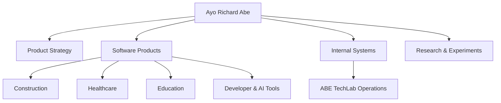

<div align="center">

# 👋 Ayo Richard Abe · gODtECH

### Product thinker. Systems builder. Technology practitioner.

<p>


</p>

**I build products that make difficult work feel simpler.**

</div>

---

## 🧭 What this repository is

This repository contains the personal portfolio site for **Ayo Richard Abe**, presenting selected products, collaborations, experiments, systems work, and product-development thinking.

<table>
<tr><td width="50%">

### 🧠 Product
Product strategy, discovery, roadmaps, workflows, and delivery.

### ⚙️ Systems
Internal tools, automation, architecture, and operational systems.

</td><td width="50%">

### 💻 Technology
JavaScript, TypeScript, React, Next.js, Node.js, Python, PostgreSQL, and Supabase.

### 🤖 Artificial Intelligence
AI-assisted workflows, agents, research, and automation.

</td></tr>
</table>

## 🚀 Selected work

| Product / project | Focus |
| --- | --- |
| **Proqurement** | Construction procurement and market discovery |
| **OHealth+** | Healthcare technology |
| **Lead Engine** | Recruitment intelligence and workflow automation |
| **Cyfamod SMS** | School management |
| **SAYRR** | Voice-first text input |
| **ABE TechLab** | Product studio and technology lab |
| **ABE TechLab Operations** | Internal operations system |
| **Waste2Light** | Renewable-energy and innovation |
| **Snare** | Software supply-chain security |

<details open>
<summary><strong>🧩 How the portfolio fits together</strong></summary>



</details>

## 🛠️ Core toolkit

JavaScript · TypeScript · React · Next.js · Node.js · Python · PostgreSQL · Supabase · GitHub · Figma

## 🌐 Site architecture

This is a lightweight static HTML, CSS, and JavaScript site deployed with GitHub Pages through `.github/workflows/pages.yml`.

<details>
<summary><strong>📁 Repository map</strong></summary>

```text
index.html
styles/
scripts/
assets/
.github/workflows/pages.yml
```

</details>

## 🔗 Explore

The live portfolio and individual project links are maintained in the site itself so the repository remains the technical source for the portfolio experience.

## 🔐 Ownership

This repository contains proprietary portfolio software, content, and project presentation materials. See [`LICENSE`](./LICENSE) for usage terms.
